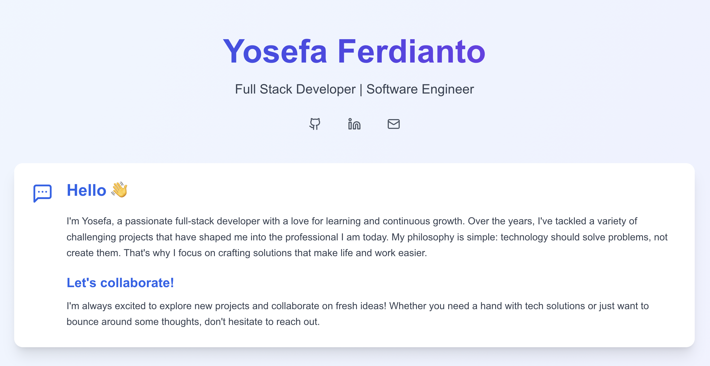

# Yosefa Ferdianto - Portfolio Website

A modern, responsive portfolio website built with React and Tailwind CSS, showcasing my professional experience, technical skills, and featured projects. The design is inspired by Google's Material Design principles and aesthetic.

> **Note**: The design and styling of this portfolio website draws inspiration from Google's clean, modern aesthetic and Material Design principles. This implementation represents my interpretation of Google's design language while maintaining originality in the overall composition and user experience.



## 🌟 Features

- Clean and modern UI with a gradient background inspired by Google's material palette
- Smooth animations and hover effects following Material Design motion principles
- Responsive design that works on all devices
- Interactive skill cards with categorized technical abilities
- Detailed project showcase with technology tags
- Social media links with hover tooltips
- Seamless navigation and user experience

## 🛠️ Built With

- React
- TypeScript
- Tailwind CSS
- Lucide React Icons
- Custom gradient effects
- Modern animation transitions

## 🚀 Technical Skills Showcased

- **Frontend Development**: HTML, CSS, Bootstrap, jQuery, React
- **Backend Development**: PHP, Node.js, Python, CodeIgniter, Express
- **Database Management**: MySQL, MariaDB, SQLite, SQL Server
- **Mobile Development**: React Native, Java, Kotlin
- **Cloud & DevOps**: Hosting, VPS, Ubuntu, RedHat, Git, Docker
- **Security & CMS**: CyberSecurity, SSL, Nginx, WordPress

## 💼 Featured Projects

- Enterprise Resource Planning System
- AI Server Infrastructure
- Smart Estimation Tools
- Advanced CCTV Monitoring
- Corporate Web Management
- Employee Loan Portal

## 🚀 Getting Started

### Prerequisites

- Node.js (v14 or higher)
- npm or yarn

### Installation

1. Clone the repository
```bash
git clone https://github.com/yosefa/ganteng.my.id.git
```

2. Navigate to the project directory
```bash
cd ganteng.my.id
```

3. Install dependencies
```bash
npm install
# or
yarn install
```

4. Start the development server
```bash
npm run dev
# or
yarn dev
```

5. Open your browser and visit `http://localhost:3000`

## 📝 Customization

To customize this portfolio for your own use:

1. Update the personal information in `Home.tsx`
2. Modify the skills in the `SkillCard` components
3. Update the project information in the `ProjectCard` components
4. Replace social media links with your own
5. Adjust the color scheme by modifying the Tailwind classes

## 🎨 Color Scheme

The website uses a carefully chosen color palette inspired by Google's Material Design:
- Primary gradient: `from-blue-50 via-indigo-50 to-purple-50`
- Text gradient: `from-blue-600 via-indigo-600 to-purple-600`
- Accent colors: Various shades of blue and indigo
- Background: White and gradient combinations

## 📱 Responsive Design

The portfolio is fully responsive and optimized for:
- Mobile devices
- Tablets
- Desktop screens
- Wide screens

## 📧 Contact

- GitHub: [@yosefa](https://github.com/yosefa)
- LinkedIn: [yosefaferdianto](https://linkedin.com/in/yosefaferdianto)
- Email: yosefa@ganteng.my.id

## 📄 License

This project is open source and available under the [MIT License](LICENSE).

## 🙏 Acknowledgments

- Design inspiration from Google's Material Design principles and aesthetic
- Icons provided by Lucide React
- Built with React and Tailwind CSS

---

Made with ♥ in Jakarta